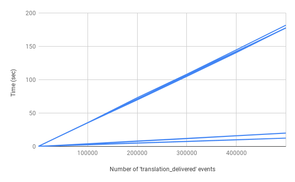

# Backend Engineering Challenge
Hello, welcome to my solution for this challenge.

One tiny note before I start explaining my solution: the original challenge is [right here](CHALL.md), and you should read it in order to understand what I'll explain next.

## Solution and Architecture
### Foreword
The problem we're being asked to solve is a combination of two different problems.

There is the problem of calculating a **running average**, which wouldn't be a problem at all if we could store all the data in memory, but isn't the case here (as I explain below).
The solution to this problem is rather easy, and it consists in simply keeping an average value and a count of how many items are being used in that average.

The other problem is a typical **sliding window problem**, which can usually be solved in _O(n)_ by using a Queue.
This task combines both these problems, which means that the **running average** will have to decrease eventually, which is a tiny variation on the usual algorithm.

A proper parallel solution to this task is not really possible unless we can load all the data into memory first and then partition the data into different windows.
As this is not the case, seen that we're working with a stream of data, I have opted to solve this in Python.
Python does have a speed problem and its best uses are in I/O-bound programs, and seen that the solution I went for is built around streams, Python sounds like a good decision.
Not to mention that it will probably be easier to read than other languages! 😄

A _Complexity Analysis_ of this solution is also provided below.

### Key Ideas
This program has been developed around the concept that its input will come **in real-time** from a stream of data, possibly bigger than the ammount of memory available for the program to run.
In this sense, we cannot solve this problem by storing all the data that we want to process.
We can, however, rely on the fact that the events that are being fed into the program are ordered chronologically by their timestamp, as they are being produced and fed to the program **in real-time**.

To solve this, the program is built around streams, meaning that it should always be processing data and outputing its results in real-time as well.
To achieve this, the program can take its input from a regular file (which in an Unix system can even be a network socket, for example), or from its standard input (`stdin`).
This way, the program can be used in statistics pipelines, composed with with other utilities, and eventually the tool that is producing its input.
It will, in no way shape or form, stop this pipeline to process data, as it will process and output data as soon as possible.

### Architecture
This solution has two main components:
  - The `metrics_cli.py` script;
  - The `metrics` module;

The `metrics_cli.py` script provides a "_front-end_" to use this tool, namely by parsing arguments and interacting with the user and the `metrics` module that is _underneath_.

The `metrics` module is where the interesting things happen, and the calculation of statistics is done.
As of right now, it only contains running average functionality, but it could easily be extended to provide other features.
The running average implementation in this module just needs to know about a JSON object stream (which is being created in `metrics_cli.py`, using the `jsonlines` module on the input file), and the window size.
With this, it will filter events to find `translation_delivered` events, and only process those.

Seen that this implementation just deals with a JSON object stream, it would be trivial to do statistics for individual clients for example!
One would need only to provide the implementation with a filtered stream, just like its being done in `running_average.py` by using Python's `filter` function.

Another important thing to mention is that I have choosen not to use an object oriented architecture, focusing more on streams and the functional design.
As much as I like OOP, I believe that solving this problem in an object oriented fashion would introduce a degree of complexity that is not needed for this application, and would like to keep it simple.

## Installing and Running
### Prerequisites
This project was developed for `Python 3.7`, and uses the PyPI packages in the `requirements.txt` file.
Before trying to run this code, you should install the packages.

Here is how you can install these packages using Pip:
```bash
pip3 install -r requirements.txt
```

Once you do this, you're all good to run the code! :)

### Running the Project
If you're running this in a Unix/Linux system, where you have a `/usr/bin/env` that knows about `python3.7`, you can just set the `metrics_cli.py` script as executable and run it, like so:
```bash
chmod u+x metrics_cli.py
./metrics_cli.py <arguments>
```

If you did not understand what I meant with `/usr/bin/env` or just want to be a little more conservative, you can run the project like so:
```bash
/path/to/python3.7 metrics_cli.py <arguments>
```

In both of these cases, I denoted the program arguments with `<arguments>`.
You can check what are the valid arguments by running the program with no arguments, or with the `-h` flag.
In any case, both the `--input_file` and `--window_size` arguments specified in the [original challenge description](CHALL.md) are required.

### Usage
The CLI application has two arguments that are mandatory.
#### input\_file
The `--input_file` is an argument that tells the program where to get a stream of JSON object from.
This stream is what will be used and processed in order to produce the running average of the translations' durations.

There are two types of arguments you can pass here, you can specify a path to a valid file (like `./path/to/events.json`), or you can pass a special value, `-`, that tells the program to read from its standard input (much like standard Unix utilities, such as `cat`).

Nonetheless, the program will read from that stream until it ends/finds `EOF`.

#### window\_size
The `--window_size` argument represents how many minutes the program will use a translation for a running average.
For example, if you pass `--window_size 10`, only translations that occurred in the last 10 minutes will be used for the current running average.


## Complexity Analysis


Talk about list vs deque O(n) vs O(1)
 TODO


## Assumptions and Notes
### Assumptions
For this solution, I am assuming the following:
  - When `window_size` is passed to the program, it is an integer representing the window size in minutes;
  - Translations arrive at the input stream with chronologically ordered timestamps;
  - The input stream contains valid JSON objects, if it is malformed the application's behavior is unspecified;
  - The input stream can contain a lot of data, eventually an ammount of data that would not fit in a computer's memory;
  - The input is being fed as a real-time stream, which can eventually halt until new events are delivered;
  - The value of `window_size` must be greater or equal than 1;
  - The window for the calculation of the moving average only cares about the timestamp of the `translation_delivered` event, and not its duration;

